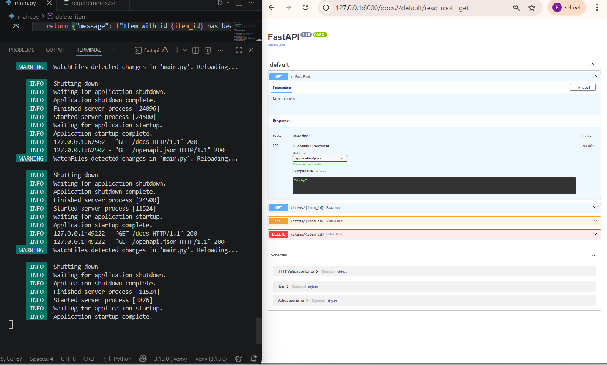

# ༘ ⋆₊ FastAPI 연습📓 ༘ ⋆₊ 

이 프로젝트는 **Python**과 **FastAPI**를 사용하여 현대적인 API 개발을 배우기 위한 첫 번째 실습 프로젝트입니다. 개발 환경 설정부터 기초적인 CRUD 라우트 생성까지의 과정을 학습했습니다.

##  학습한 핵심 개념

프로젝트를 진행하며 다음과 같은 기술적 개념들을 익혔습니다:

* **가상 환경 (venv):** 시스템 설정과 충돌을 피하기 위해 프로젝트만의 독립적인 라이브러리 실행 환경을 구축하는 방법을 배웠습니다.
* **FastAPI & Uvicorn:** 웹 프레임워크(FastAPI)와 비동기 처리를 지원하는 ASGI 서버(Uvicorn)의 관계를 이해했습니다.
* **HTTP 메소드 (Verbs):** API 통신에 필요한 주요 메소드들을 직접 구현했습니다:
    * `GET`: 데이터 조회 (Root 경로 및 특정 ID 아이템 조회)
    * `PUT`: JSON 바디를 통한 기존 데이터 수정
    * `DELETE`: 리소스 삭제 기능 시뮬레이션
* **Pydantic 모델:** 데이터 검증을 위해 클래스 기반의 데이터 구조를 정의하고 사용했습니다.
* **자동 문서화 (Swagger UI):** FastAPI가 `/docs` 경로를 통해 자동으로 생성해 주는 대화형 API 문서 사용법을 익혔습니다.

##  실행 방법

1.  가상 환경 활성화:
    ```powershell
    .\.venv\Scripts\activate
    ```
2.  필수 라이브러리 설치:
    ```powershell
    pip install -r requirements.txt
    ```
3.  서버 실행:
    ```powershell
    uvicorn main:app --reload
    ```

## 📸 대화형 API 문서
FastAPI는 별도의 도구 없이도 `http://127.0.0.1:8000/docs`에서 API를 직접 테스트할 수 있는 시각적인 인터페이스를 제공합니다. 이곳에서 GET, PUT, DELETE 요청을 실시간으로 확인하고 테스트할 수 있습니다.

 
