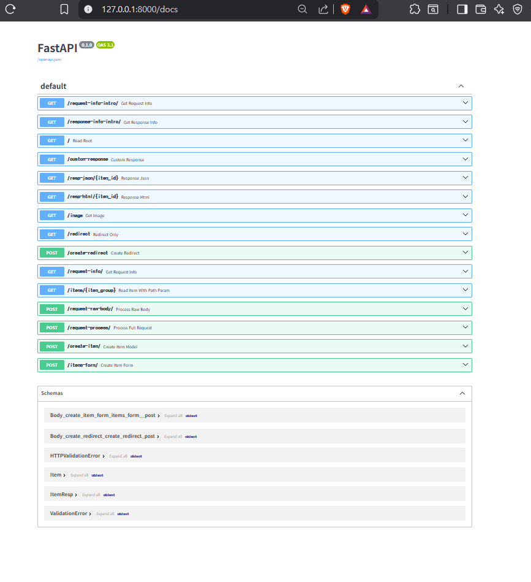
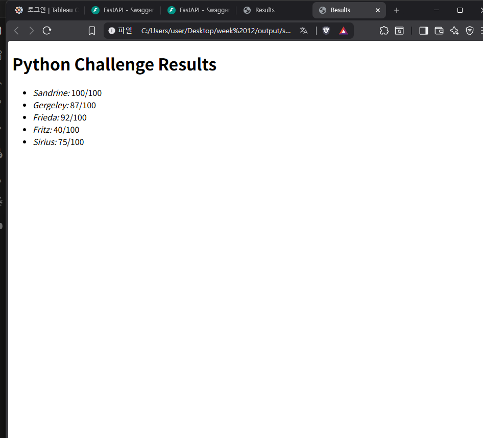
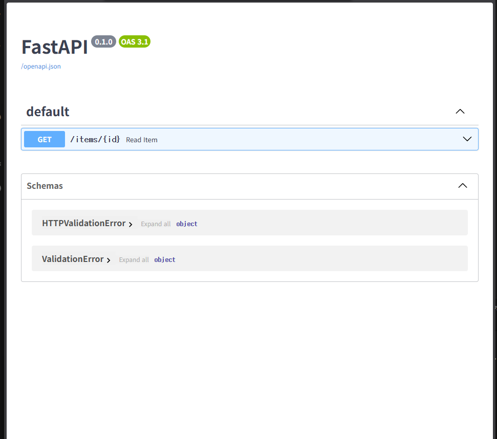

꩜༘⋆
      ‧₊˚ ⋅
     FastAPI & Jinja2 실습 요약 (Week 12)
                                        ꩜༘⋆
                                         ‧₊˚ ⋅
     

FastAPI를 활용한 백엔드 API 구조 설계와 Jinja2 엔진을 사용한 동적 템플릿 웹페이지 생성 실습을 진행했습니다.

## 1. FastAPI 백엔드 개발 (main2.py)
Request/Response 제어: 클라이언트 메타정보(IP, User-Agent) 추출 및 HTTP 상태 코드, 커스텀 헤더 직접 조작.

다양한 응답 타입: JSONResponse, HTMLResponse, FileResponse 활용.

데이터 유효성 검사: Pydantic 모델을 사용하여 입력/출력 데이터를 분리하고 자동 검증 수행.

## 2. Jinja 동적 템플릿 출력 (jinja.py)
동적 웹페이지 생성: HTML 내부에 반복문()과 조건문()을 삽입하여 데이터 매핑 자동화.

파일 분리 관리: 파이썬 로직과 HTML 디자인 레이어(results.html)를 분리하여 대량의 리포트 생성 효율성 확보.

 

Jinja2 템플릿 파일 구조 (__pycache__ 확인)
브라우저 최종 렌더링 결과 (results.html)

## ⢰ 개발 환경 
Python 3.9 환경에서의 버그 및 의존성 충돌을 방지하기 위해 아래 버전을 지정하여 빌드했습니다: